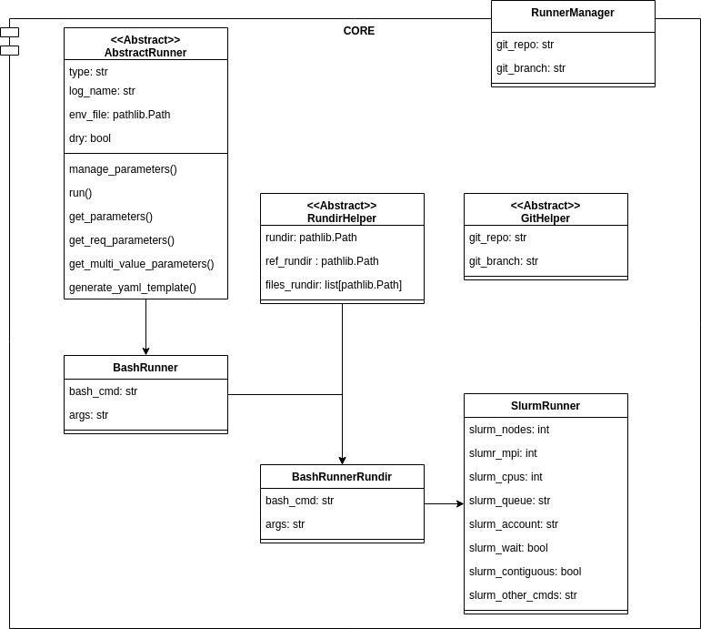

# YAW

**Y**et **a**nother **w**orkflow. Workflow to automate repetitive processes, build with Python and Bash.

Version: v0.96.0 - Alpha

- [YAW](#yaw)
  - [Introduction](#introduction)
  - [Installation](#installation)
  - [Usage](#usage)
  - [Examples](#examples)
  - [Extending the functionalities](#extending-the-functionalities)
    - [UML overview - Runners](#uml-overview---runners)
    - [Creating your runner](#creating-your-runner)


## Introduction
YAW parses recipe files (in YAML format) and executes each step described in the recipe. Each step contains several parameters that tune the execution of the step.


The most powerful capability of this tool is the ability to generate recipe variations; if the recipe contains a multivalue parameter (list)
YAW automatically generates all the combinations (cartesian mode) or joins by order of the different values(zip mode). This allows systematical executions
with only writing a YAML file. There are several "runners" available to run steps using bash, manage a running directory, or submit the execution using SLURM.

## Installation
Clone the repository with `--recursive` or initialize the submodules.
````bash
git clone git@github.com:correalramos24/YAW.git --recursive
# OR
git clone git@github.com:correalramos24/YAW.git
cd YAW
git submodule init
git submodule update
````
Add the `bin` folder to the path of your system and call `yaw` to execute the application.

## Usage
1. Generate recipe template: Use `--generate <recipie type>` to generate an empty template.

2. Run recipies: Use `yaw <recipe file(s)>` to run the recipies. YAW will first parse the recipes and then run them sequentially.

3. Check the results: Check the output from the command line to see the execution results.

## Examples
TBD

## Extending the functionalities

Despite being recommended to tune your functionalities using your bash scripts you can also extend YAW
core to support **new types of recipie**. This section will briefly summarize the modular design,
to make it easy to extend the functionalities of this application.

### UML overview - Runners

A runner is the basic object used by YAW to execute the steps of a recipe. The `RundirManager` contains all the logic to 
parse the recipes and execute them; if you want to include a new runner you need to include it and added to the `runners` dictionary.



### Creating your runner

You can inherit from any of the core objects to extende the functionality 
to meet your requirements. The Abstract runner defines differents sub-steps
common for all the recipies in order to parse the recipie and execute it:

1. builder: The build method of the object checks the required arguments, defined at each object in the `get_required_params()` method.
2. `manage_parameters()` : Checks about the parameters (line build rundir, print warning logs)
3. `run()` : Execute the recipe.

Apart from the execution, for the template generation there is one specific method, 
called `generate_yaml_template()`, which contains all the logic to generate
the template YAML file, with some comments. 

Check the `core/AbstractRunner.py` for mode details. The utils python package
contains utilities methods to manage bash scripts, environments and SLURM scripts.


As an example, here you have an example to extend the Slurm runner to add
new type of runner.

````python
@dataclass
class NemoRunner(SlurmRunner):
    type: str = "NemoRunner"
    nemo_root : Path = None
    nemo_cfg : str = None
    WRAPPER_NAME="nemo.slurm"
    def manage_parameters(self):
        super().manage_parameters()
        # YOUR OVERIDE
        
        
    def inflate_runner(self):
        generate_slurm_script(Path(self.rundir, self.WRAPPER_NAME),
            self.log_name, self._get_slurm_directives(), 
            [
                "# loading and saving the source:",
                f"source {self.env_file}" if self.env_file else "",
                "printenv &> env.log",
                "# Editing namelist parameters:",
                f"sed -i 's/nn_stock=.*/nn_stock=-1/' \"namelist_cfg\"",
                f"sed -i 's/[[:space:]]*nn_stock[[:space:]]*=[[:space:]]*.*/nn_stock=-1/' \"namelist_cfg\"",
                f"sed -i \"s/nn_itend[ \\t]*=.*/nn_itend={self.steps}/\" namelist_cfg",
                "# Running the model:",
                f"srun ./nemo.exe $@"
            ]
        )
    
    @classmethod
    def _inflate_yaml_template_info(cls):
        parameters_info = super()._inflate_yaml_template_info()
        parameters_info.extend([
            ("comment", "NEMO PARAMETERS"),
            ("nemo_root", "nemo installation root"),
            ("nemo_cfg" ,  "nemo cfg to be executed"),
            ("steps" , "model steps to be executed (10 by default)")
        ])
        return parameters_info
````
